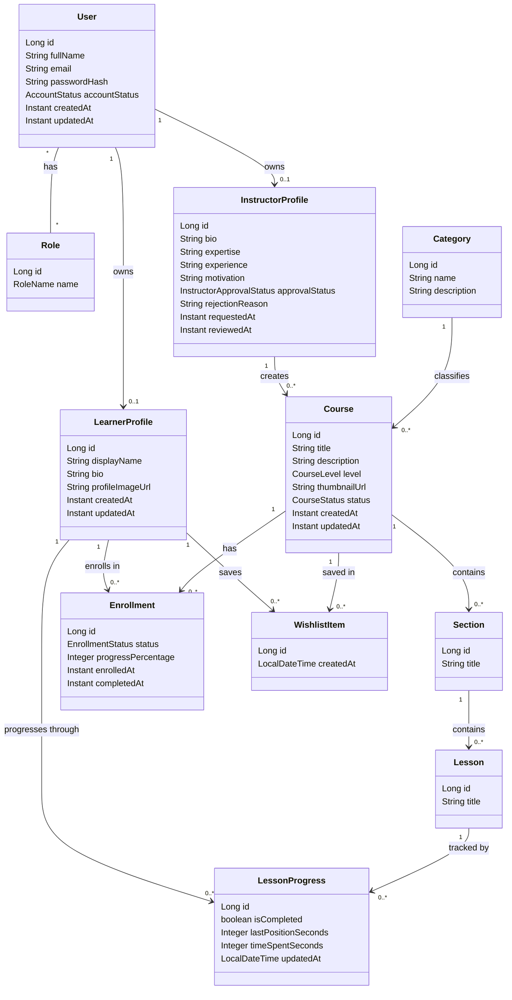
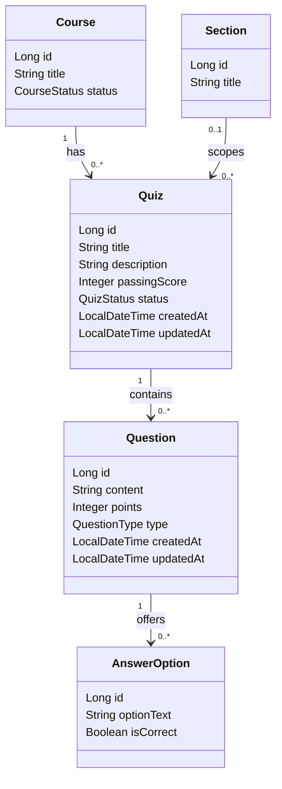

# Class Diagram

This document presents the UML class diagram of the **Learnova** learning
platform. It describes the main backend **domain entities** (JPA `@Entity`
classes) and the relationships between them as they are actually modelled in the
source code under `backend/src/main/java`.

The diagram is intended for the project report. It focuses on the persistent
domain model only — identity and profiles, the course structure, enrollment and
progress tracking, the wishlist, and the quiz/assessment model. Controllers,
services, repositories, DTOs, security infrastructure, and the React frontend
are intentionally excluded (see *Scope notes*).

All classes, fields, enums, and associations below are taken directly from the
entity classes. Nothing has been invented.

---

## Main domain model

This first diagram shows the central LMS model: users and roles, the dual
profiles, the course structure (category → course → section → lesson),
enrollment, lesson progress, and the wishlist.

### Relationship notes (main model)

- **User ↔ Role** is a many-to-many association implemented through the
  `user_roles` join table (`@ManyToMany` + `@JoinTable`). It is a plain
  association table, not a domain entity, so it is shown as a `* -- *`
  relationship rather than as a separate class.
- **User ↔ LearnerProfile** and **User ↔ InstructorProfile** are one-to-one.
  The foreign key (`user_id`) lives on the profile side; a user has at most one
  of each profile.
- **InstructorProfile → Course** is one-to-many: an instructor profile is the
  owner of the courses it creates (`Course.instructorProfile`).
- **Category → Course** is one-to-many: every course belongs to exactly one
  category.
- **Course → Section → Lesson** is the course content hierarchy. Sections
  cascade-delete their lessons (`orphanRemoval = true`).
- **Enrollment** is the link between a `LearnerProfile` and a `Course`, with a
  unique constraint on `(learner_profile_id, course_id)` so a learner can enrol
  in a course only once. It carries the enrollment `status` and a
  `progressPercentage` rollup.
- **LessonProgress** records a learner's progress on a single lesson, with a
  unique constraint on `(learner_profile_id, lesson_id)`. It links to
  `LearnerProfile` and `Lesson` directly — not through `Enrollment`.
- **WishlistItem** is a saved-course entry linking a `LearnerProfile` to a
  `Course`, with a unique constraint on `(learner_profile_id, course_id)`.

---

## Quiz and assessment model

The quiz model is implemented but is kept in a separate diagram to keep the main
model readable. A `Quiz` belongs to a `Course` and may optionally be attached to
a single `Section`.

### Relationship notes (quiz model)

- **Course → Quiz** is one-to-many and mandatory: every quiz belongs to a
  course (`Quiz.course`, `nullable = false`).
- **Section → Quiz** is optional (`Quiz.section` is nullable). A quiz can be
  scoped to a specific section of its course, or remain a course-level quiz when
  no section is set.
- **Quiz → Question → AnswerOption** is a two-level composition. Questions
  cascade-delete with their quiz, and answer options cascade-delete with their
  question (`orphanRemoval = true`).

---

## Enumerations

The following enums are used by the entities above. They are listed here rather
than inside the classes to keep the diagrams compact.

| Enum | Used by | Values |
|------|---------|--------|
| `AccountStatus` | `User.accountStatus` | `ACTIVE`, `DISABLED`, `SUSPENDED` |
| `RoleName` | `Role.name` | `ROLE_LEARNER`, `ROLE_INSTRUCTOR`, `ROLE_ADMIN` |
| `InstructorApprovalStatus` | `InstructorProfile.approvalStatus` | `PENDING`, `APPROVED`, `REJECTED` |
| `CourseLevel` | `Course.level` | `BEGINNER`, `INTERMEDIATE`, `ADVANCED`, `ALL_LEVELS` |
| `CourseStatus` | `Course.status` | `DRAFT`, `PUBLISHED`, `ARCHIVED` |
| `EnrollmentStatus` | `Enrollment.status` | `ACTIVE`, `COMPLETED`, `CANCELLED` |
| `QuizStatus` | `Quiz.status` | `DRAFT`, `PUBLISHED`, `ARCHIVED` |
| `QuestionType` | `Question.type` | `MULTIPLE_CHOICE`, `TRUE_FALSE` |

> `ProfileType` (`LEARNER`, `INSTRUCTOR`) also exists in the domain but is used
> for profile switching at the service/API layer, not as a persisted entity
> field, so it does not appear in the diagrams.

---

## Domain explanation

**User and profile separation.** Identity and learning/teaching capabilities are
deliberately separated. `User` holds the account (credentials, email, account
status, roles). The two capabilities a user can have are modelled as separate
one-to-one entities — `LearnerProfile` and `InstructorProfile` — each keyed by
`user_id`. A learner profile is created automatically on registration; the
instructor profile is created on request. This is the structural basis for
Learnova's dual-profile system, where a single account can act as both learner
and instructor.

**Instructor approval model.** `InstructorProfile` carries its own approval
lifecycle through `approvalStatus` (`PENDING` → `APPROVED` / `REJECTED`),
together with `rejectionReason`, `requestedAt`, and `reviewedAt`. An instructor
profile must be approved by an administrator before the instructor role is
effectively granted, which is why the approval state lives on the profile entity
itself rather than on `User`.

**Course structure.** Teaching content is owned by an `InstructorProfile` and
organised as a hierarchy: a `Course` belongs to one `Category` and one
instructor, contains ordered `Section`s, and each section contains ordered
`Lesson`s. The `Course.status` enum (`DRAFT` / `PUBLISHED` / `ARCHIVED`) governs
visibility in the public catalog.

**Enrollment and progress tracking.** A learner joins a published course through
an `Enrollment`, which is unique per (learner, course) pair and records its
`status` and an overall `progressPercentage`. Fine-grained progress is tracked
separately by `LessonProgress`, one row per (learner, lesson), holding the
completion flag and optional playback/time-spent data. The course-level
percentage on `Enrollment` is a rollup derived from the individual lesson
progress rows; there is no direct foreign key from `LessonProgress` to
`Enrollment`.

**Wishlist / saved courses.** A learner can save courses for later through
`WishlistItem`, a join entity between `LearnerProfile` and `Course` that is
unique per (learner, course). Saving a course is independent of enrollment — it
does not enrol the learner or unlock content.

**Quiz model.** Assessment is modelled by `Quiz`, `Question`, and `AnswerOption`.
A quiz belongs to a course (and optionally to a section), defines a
`passingScore`, and has its own publication `status`. Each quiz contains
questions of a given `QuestionType` (`MULTIPLE_CHOICE` or `TRUE_FALSE`), and
each question offers answer options flagged with `isCorrect`.

---

## Scope notes

The diagrams above represent the **persistent domain model only**. The following
are intentionally excluded:

- **Controllers, services, and repositories** — the application, web, and data-
  access layers. They orchestrate the entities but are not part of the domain
  model.
- **DTOs** (request/response POJOs) — these are API-shaped projections of the
  entities, not domain classes.
- **Security infrastructure** — `JwtService`, `JwtAuthenticationFilter`,
  `CustomUserDetails`, `SecurityConfig`, etc.
- **The `user_roles` join table** — shown as a many-to-many association, not as
  a class, because it is a plain association table with no extra attributes.
- **The React frontend** — components, hooks, and pages are out of scope for a
  backend domain class diagram.

The diagrams use standard Mermaid `classDiagram` syntax (no colours, no HTML,
no unsupported constructs) so they render directly in the report.
