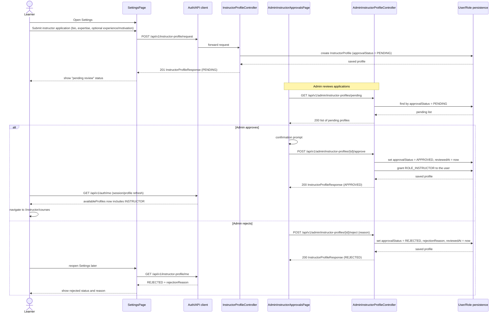
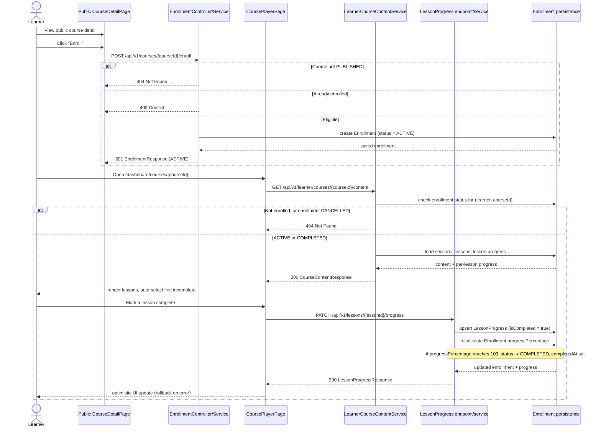
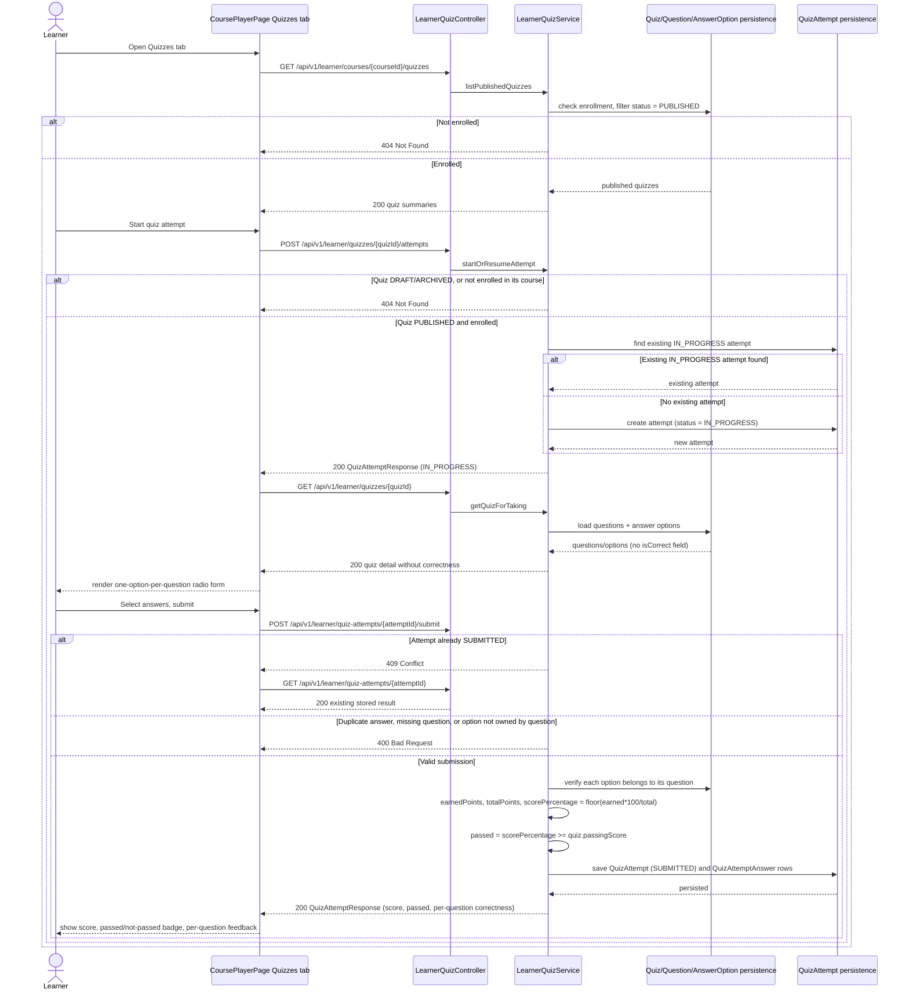
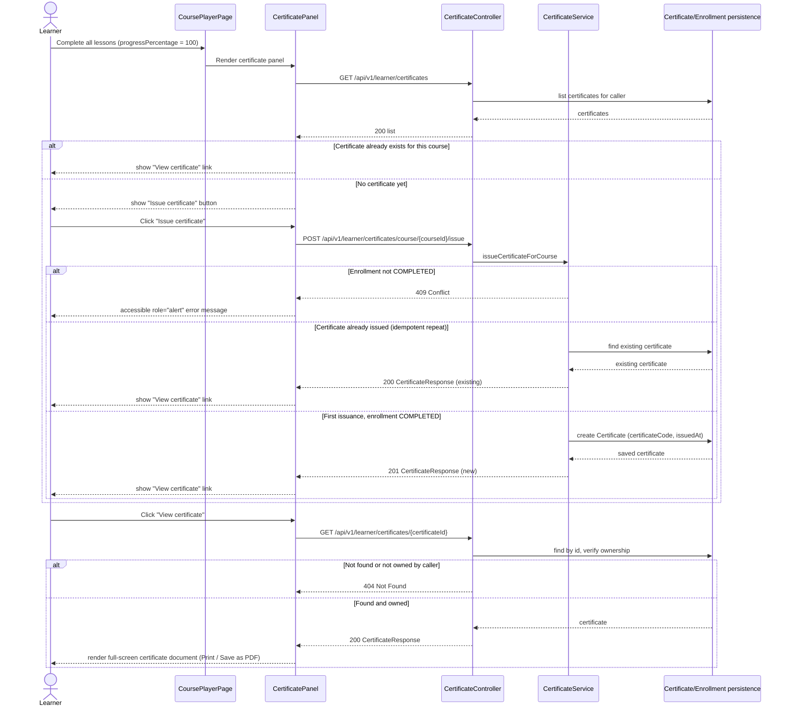

# Sequence Diagrams

## Scope

The diagrams below reflect the current, implemented state of the system —
they are derived from the actual controllers and services under
`backend/src/main/java`, not from planned or aspirational behavior. They
complement `docs/report/core-workflows.md` (textual workflow descriptions)
and `docs/report/class-diagram.md` (domain model) with a call-sequence view
for the four flows most relevant to the PFA demo. Internal helper method
calls are omitted in favor of readability; only the participant-to-participant
calls relevant to each flow are shown.

---

## 1. Instructor Application and Approval

**Notes:**
- **Status transitions** — an instructor profile starts `PENDING` on
  request and moves to exactly one of `APPROVED` or `REJECTED`; there is no
  reverse transition modeled in the backend.
- **Role grant** — `ROLE_INSTRUCTOR` is granted on the `User` entity at the
  moment of approval (`InstructorProfileService.approveInstructorProfile`).
  It is **admin approval, and only admin approval, that grants instructor
  access** — there is no self-service path to the role.
- **Session refresh** — the frontend does not get the new role pushed to
  it; it must re-fetch `/api/v1/auth/me` (via `useCurrentUser` or an
  equivalent refresh) to see `availableProfiles` updated before instructor
  routes become reachable.
- **Rejection branch** — rejection stores a `rejectionReason` and
  `reviewedAt` but does not grant any role; the Settings page surfaces this
  reason on a later visit via `GET /api/v1/instructor-profile/me`.

---

## 2. Learner Enrollment and Lesson Progress

**Notes:**
- **Enrollment-gated access** — `GET /api/v1/learner/courses/{courseId}/content`,
  `PATCH /api/v1/lessons/{lessonId}/progress`, and
  `GET /api/v1/lessons/course/{courseId}/progress` all require an ACTIVE or
  COMPLETED enrollment. A learner who is **not enrolled, or whose enrollment
  is CANCELLED, receives 404 — not 403** — so that course existence cannot be
  enumerated by id.
- **Progress sync** — `progressPercentage` on `Enrollment` is not stored
  independently; it is recalculated from the count of completed
  `LessonProgress` rows in the same transaction as the lesson-progress
  update, and the enrollment status flips to `COMPLETED` automatically when
  it reaches 100%. Dashboard and progress pages read this rolled-up value
  rather than recomputing it themselves.
- The course player's lesson content area itself (video/body) is a
  placeholder panel — this diagram covers progress tracking only, not
  content rendering.

---

## 3. Learner Quiz Attempt and Scoring

**Notes:**
- **Correct answer secrecy** — the learner-facing quiz detail
  (`LearnerAnswerOptionResponse`) never includes an `isCorrect` field.
  Correctness is computed and revealed only after submission, inside the
  per-question results of `QuizAttemptResponse`.
- **Scoring rule** — `scorePercentage = floor(earnedPoints * 100 /
  totalPoints)`; `passed = scorePercentage >= quiz.passingScore`. A question
  earns its full point value only if the selected option is correct,
  otherwise zero.
- **Access control** — every learner quiz endpoint is enrollment-gated and
  quiz-status-gated: a non-enrolled learner, a DRAFT/ARCHIVED quiz, or a
  mismatched course all resolve to `404` (not `403`), consistent with the
  enumeration-prevention pattern used elsewhere in the API. Resubmitting an
  already-`SUBMITTED` attempt returns `409`, after which the frontend falls
  back to fetching the stored result rather than treating it as an error.
  There is no attempt-history list — only the most recent attempt's result
  is retrievable by id.

---

## 4. Learner Certificate Issuance

**Notes:**
- **Manual trigger, not automatic** — reaching 100% progress only makes the
  certificate panel appear; the `POST .../issue` call happens only on an
  explicit learner click. Nothing issues a certificate as a side effect of
  the lesson-progress endpoint itself.
- **Idempotent issuance** — a repeat `POST .../issue` call for a course that
  already has a certificate returns `200` with the existing certificate
  rather than creating a duplicate or erroring.
- **Completion gate** — `CertificateService` rejects issuance with `409` if
  the caller's enrollment for the course is not `COMPLETED`; the frontend
  surfaces this as an accessible (`role="alert"`) message in the panel
  rather than a silent failure.
- **No PDF generation** — the certificate view renders an HTML document and
  relies on the browser's native print dialog (`window.print()`) for a PDF;
  there is no server-side rendering, email delivery, or sharing endpoint.
