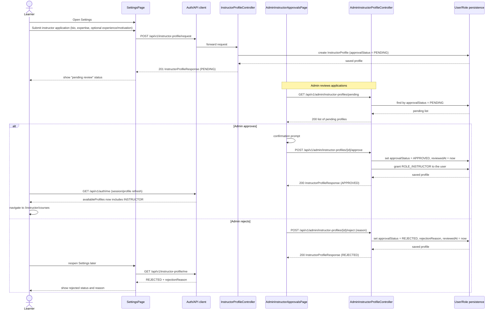
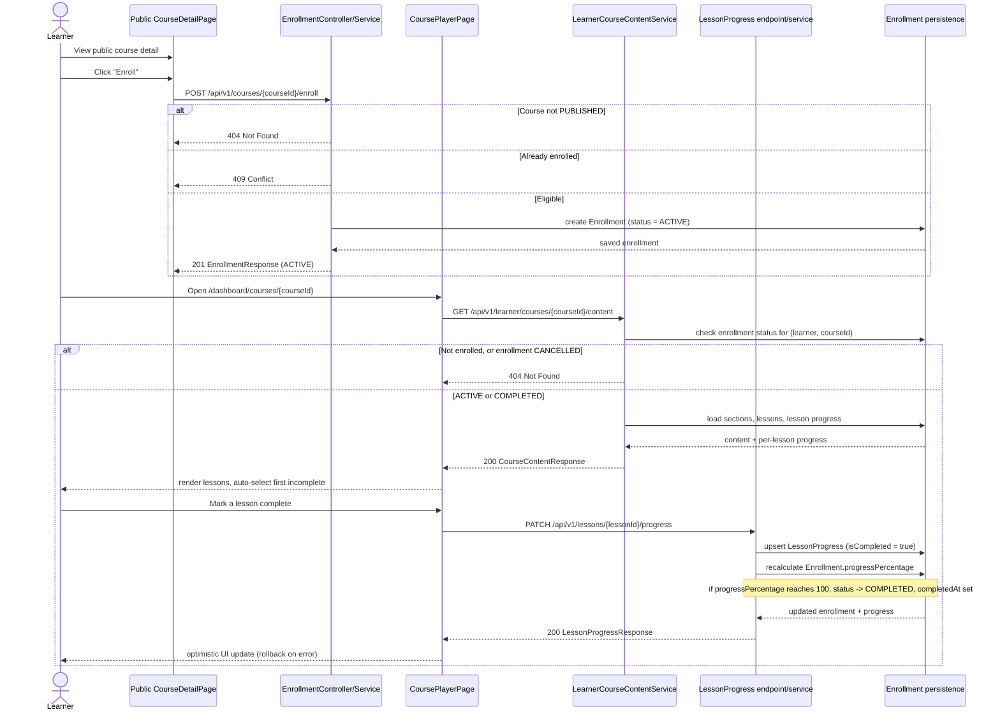
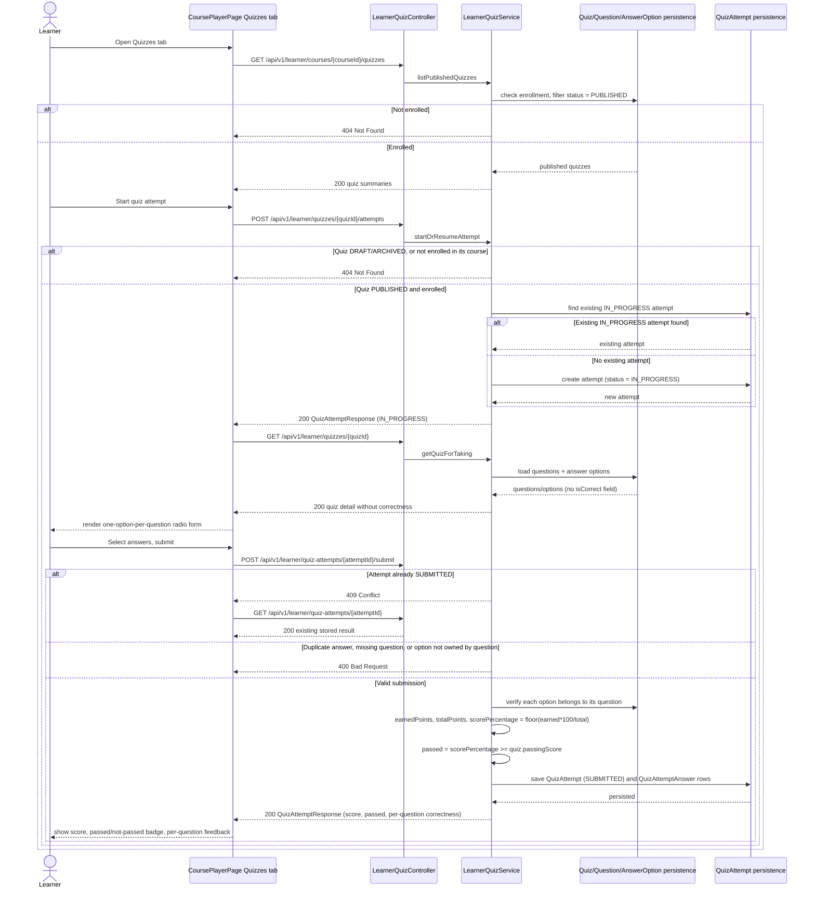
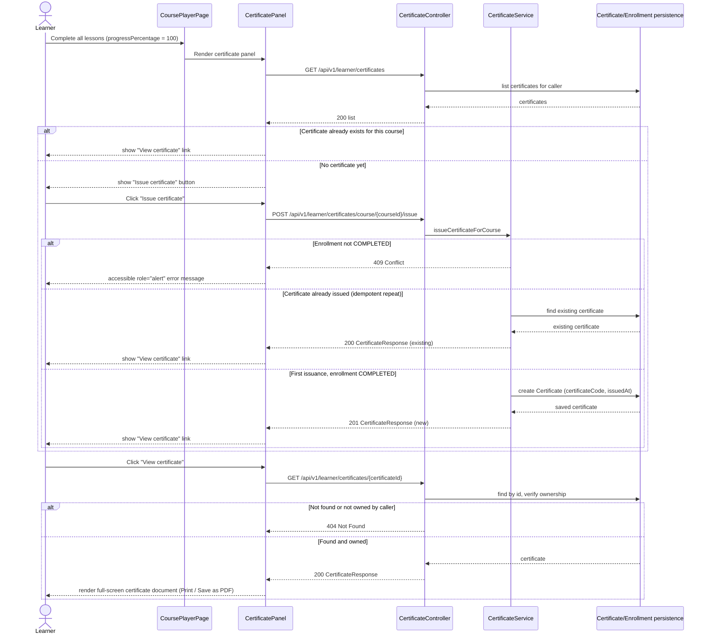
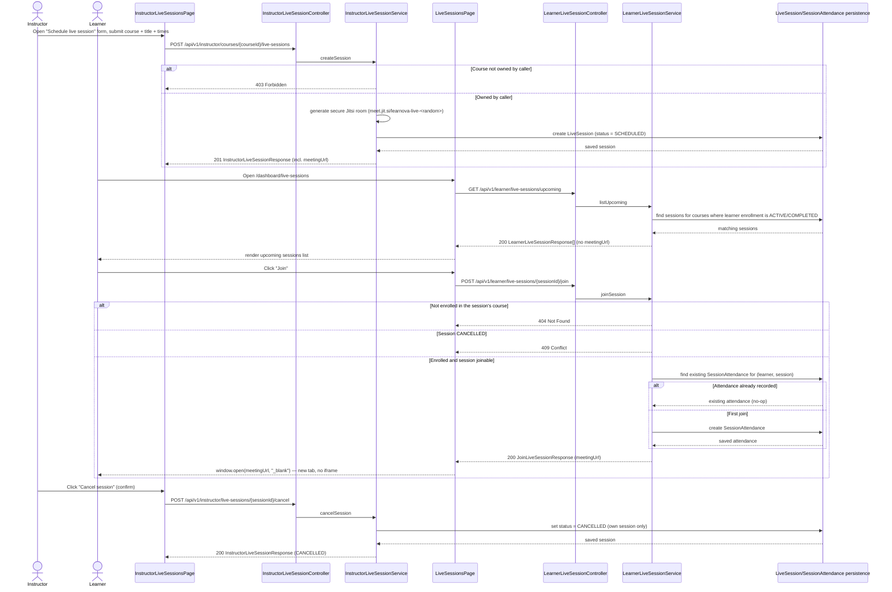
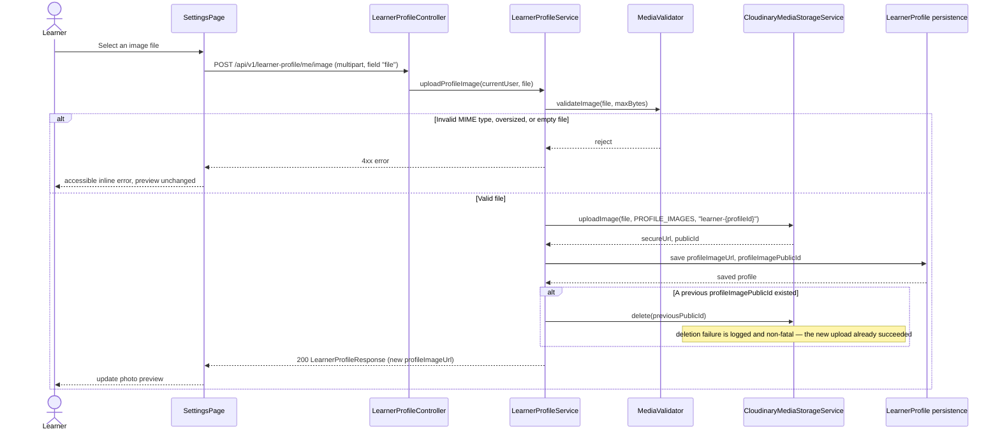
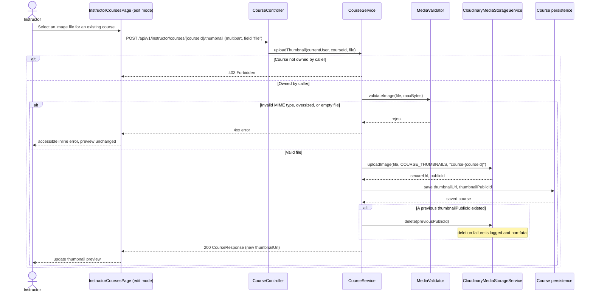

# Sequence Diagrams

## Scope

The diagrams below reflect the current, implemented state of the system —
they are derived from the actual controllers and services under
`backend/src/main/java`, not from planned or aspirational behavior. They
complement `docs/report/core-workflows.md` (textual workflow descriptions)
and `docs/report/class-diagram.md` (domain model) with a call-sequence view
for the nine flows most relevant to the PFA demo. Internal helper method
calls are omitted in favor of readability; only the participant-to-participant
calls relevant to each flow are shown.

---

## 1. Instructor Application and Approval



**Notes:**
- **Status transitions** — an instructor profile starts `PENDING` on
  request and moves to exactly one of `APPROVED` or `REJECTED`; there is no
  reverse transition modeled in the backend.
- **Role grant** — `ROLE_INSTRUCTOR` is granted on the `User` entity at the
  moment of approval (`InstructorProfileService.approveInstructorProfile`).
  It is **admin approval, and only admin approval, that grants instructor
  access** — there is no self-service path to the role.
- **Session refresh** — the frontend does not get the new role pushed to
  it; it must re-fetch `/api/v1/auth/me` (via `useCurrentUser` or an
  equivalent refresh) to see `availableProfiles` updated before instructor
  routes become reachable.
- **Rejection branch** — rejection stores a `rejectionReason` and
  `reviewedAt` but does not grant any role; the Settings page surfaces this
  reason on a later visit via `GET /api/v1/instructor-profile/me`.

---

## 2. Learner Enrollment and Lesson Progress



**Notes:**
- **Enrollment-gated access** — `GET /api/v1/learner/courses/{courseId}/content`,
  `PATCH /api/v1/lessons/{lessonId}/progress`, and
  `GET /api/v1/lessons/course/{courseId}/progress` all require an ACTIVE or
  COMPLETED enrollment. A learner who is **not enrolled, or whose enrollment
  is CANCELLED, receives 404 — not 403** — so that course existence cannot be
  enumerated by id.
- **Progress sync** — `progressPercentage` on `Enrollment` is not stored
  independently; it is recalculated from the count of completed
  `LessonProgress` rows in the same transaction as the lesson-progress
  update, and the enrollment status flips to `COMPLETED` automatically when
  it reaches 100%. Dashboard and progress pages read this rolled-up value
  rather than recomputing it themselves.
- The course player's lesson content area itself (video/body) is a
  placeholder panel — this diagram covers progress tracking only, not
  content rendering.

---

## 3. Learner Quiz Attempt and Scoring



**Notes:**
- **Correct answer secrecy** — the learner-facing quiz detail
  (`LearnerAnswerOptionResponse`) never includes an `isCorrect` field.
  Correctness is computed and revealed only after submission, inside the
  per-question results of `QuizAttemptResponse`.
- **Scoring rule** — `scorePercentage = floor(earnedPoints * 100 /
  totalPoints)`; `passed = scorePercentage >= quiz.passingScore`. A question
  earns its full point value only if the selected option is correct,
  otherwise zero.
- **Access control** — every learner quiz endpoint is enrollment-gated and
  quiz-status-gated: a non-enrolled learner, a DRAFT/ARCHIVED quiz, or a
  mismatched course all resolve to `404` (not `403`), consistent with the
  enumeration-prevention pattern used elsewhere in the API. Resubmitting an
  already-`SUBMITTED` attempt returns `409`, after which the frontend falls
  back to fetching the stored result rather than treating it as an error.
  The full attempt history (not just the most recent attempt) is retrievable
  via `GET /api/v1/learner/quizzes/{quizId}/attempts` — see §4 below.

---

## 4. Learner Quiz Retake and Attempt History

```mermaid
sequenceDiagram
    actor Learner
    participant Quizzes as CoursePlayerPage Quizzes tab
    participant QuizCtrl as LearnerQuizController
    participant QuizSvc as LearnerQuizService
    participant ADB as QuizAttempt/QuizAttemptAnswer persistence

    Learner->>Quizzes: Open Quizzes tab
    Quizzes->>QuizCtrl: GET /api/v1/learner/courses/{courseId}/quizzes
    QuizCtrl-->>Quizzes: 200 quiz summaries

    par Per-quiz attempt history (non-blocking)
        Quizzes->>QuizCtrl: GET /api/v1/learner/quizzes/{quizId}/attempts
        QuizCtrl->>QuizSvc: listAttempts
        QuizSvc->>ADB: find attempts by (learnerProfileId, quizId), order by startedAt desc

        alt Not enrolled, or quiz DRAFT/ARCHIVED
            QuizSvc-->>Quizzes: 404 Not Found
            Note over Quizzes: that quiz card's history panel stays empty (Promise.allSettled)
        else Enrolled and quiz PUBLISHED
            ADB-->>QuizSvc: attempts (most-recent-first)
            QuizSvc->>ADB: load QuizAttemptAnswer rows for SUBMITTED attempts only
            ADB-->>QuizSvc: per-question results (IN_PROGRESS attempts have none)
            QuizSvc-->>Quizzes: 200 QuizAttemptResponse[] (no isCorrect leak on IN_PROGRESS)
            Quizzes-->>Learner: render attempt-history panel (number, date, status, score)
        end
    end

    Learner->>Quizzes: Start or resume attempt
    Quizzes->>QuizCtrl: POST /api/v1/learner/quizzes/{quizId}/attempts
    QuizCtrl->>QuizSvc: startOrResumeAttempt
    QuizSvc->>ADB: find existing IN_PROGRESS attempt

    alt IN_PROGRESS attempt exists
        ADB-->>QuizSvc: existing attempt (resumed)
    else No IN_PROGRESS attempt (first attempt or all prior attempts SUBMITTED)
        QuizSvc->>ADB: create new QuizAttempt (status = IN_PROGRESS)
        ADB-->>QuizSvc: new attempt
        Note over ADB: any earlier SUBMITTED attempts are untouched
    end
    QuizSvc-->>Quizzes: 200 QuizAttemptResponse (IN_PROGRESS)

    Learner->>Quizzes: Answer questions, submit
    Quizzes->>QuizCtrl: POST /api/v1/learner/quiz-attempts/{attemptId}/submit
    QuizCtrl->>QuizSvc: submitAttempt
    QuizSvc->>QuizSvc: compute scorePercentage, passed
    QuizSvc->>ADB: save QuizAttempt (SUBMITTED) and QuizAttemptAnswer rows
    ADB-->>QuizSvc: persisted
    QuizSvc-->>Quizzes: 200 QuizAttemptResponse (score, passed, per-question results)
    Quizzes-->>Learner: show result panel; refresh attempt-history panel for this quiz

    Learner->>Quizzes: Click "Retake quiz"
    Note over Quizzes,QuizCtrl: Same POST .../attempts call as above — since the\nprior attempt is SUBMITTED (not IN_PROGRESS), a new\nattempt is created, and the old SUBMITTED attempt\nremains stored and visible in the attempt-history panel.
```

**Notes:**
- **Retake is the same start/resume endpoint.** There is no separate
  "retake" backend endpoint — `POST /api/v1/learner/quizzes/{quizId}/attempts`
  is idempotent for an `IN_PROGRESS` attempt and creates a fresh attempt once
  the prior one is `SUBMITTED`. This is the same call UC-10 uses for the
  first attempt.
- **History never overwrites.** Every `SUBMITTED` `QuizAttempt` row persists
  indefinitely; retaking only ever adds a new row, so `GET
  /api/v1/learner/quizzes/{quizId}/attempts` always reflects the full
  history, most-recent-first.
- **Correctness secrecy holds in history too.** `IN_PROGRESS` attempts have
  no `QuizAttemptAnswer` rows yet (they are created only on submit), so the
  attempt-history response for an in-progress attempt is structurally
  incapable of leaking `isCorrect` — confirmed by
  `listAttemptsDoesNotExposeIsCorrect` in `LearnerQuizIntegrationTest`.
- **Non-blocking per-quiz fetch.** The frontend fetches attempt history per
  quiz with `Promise.allSettled`; a `404`/error for one quiz's history does
  not block the quiz list or other quizzes' history panels from rendering.

---

## 5. Learner Certificate Issuance



**Notes:**
- **Manual trigger, not automatic** — reaching 100% progress only makes the
  certificate panel appear; the `POST .../issue` call happens only on an
  explicit learner click. Nothing issues a certificate as a side effect of
  the lesson-progress endpoint itself.
- **Idempotent issuance** — a repeat `POST .../issue` call for a course that
  already has a certificate returns `200` with the existing certificate
  rather than creating a duplicate or erroring.
- **Completion gate** — `CertificateService` rejects issuance with `409` if
  the caller's enrollment for the course is not `COMPLETED`; the frontend
  surfaces this as an accessible (`role="alert"`) message in the panel
  rather than a silent failure.
- **No PDF generation** — the certificate view renders an HTML document and
  relies on the browser's native print dialog (`window.print()`) for a PDF;
  there is no server-side rendering, email delivery, or sharing endpoint.

---

## 6. Live Session Scheduling, Viewing, and Join



**Notes:**
- **Meeting URL secrecy until join.** `LearnerLiveSessionResponse` never
  includes `meetingUrl`/`meetingRoomName`; the URL is returned only by the
  join endpoint, after enrollment and session-status checks pass.
- **No iframe, no Jitsi auth.** The frontend opens the Jitsi URL in a new
  browser tab. There is no Jitsi JWT/JaaS integration — the unguessable,
  securely-generated room name is the only access control once the URL has
  been issued.
- **Idempotent attendance.** A duplicate join for the same (learner,
  session) pair does not create a second `SessionAttendance` row.
- **Ownership and enrollment gates mirror the rest of the API.** Instructor
  mutations are ownership-checked (`403` for another instructor's course);
  learner join is enrollment-gated (`404` for non-enrolled, `409` for a
  cancelled session) — consistent with the enumeration-prevention and
  access-control patterns used elsewhere in the platform.

---

## 7. Approved Instructor Switches Active Profile

```mermaid
sequenceDiagram
    actor Instructor as Approved Instructor
    participant Layout as DashboardLayout / InstructorLayout / SettingsPage
    participant Hook as useProfileSwitch
    participant API as src/api/profile.ts
    participant Ctrl as ProfileSwitchController
    participant Svc as ProfileSwitchService
    participant Access as ProfileAccessService

    Instructor->>Layout: Click "Switch to instructor" / "Back to learner dashboard" / "Go to teaching area"
    Layout->>Hook: switchTo(profileType)
    Hook->>API: switchActiveProfile(profileType)
    API->>Ctrl: POST /api/v1/profile/switch { profileType }
    Ctrl->>Svc: switchProfile(user, profileType)
    Svc->>Access: canUseProfile(user, profileType)

    alt Profile not available to caller
        Access-->>Svc: false
        Svc-->>Ctrl: 403 Forbidden
        Ctrl-->>Hook: 403
        Hook-->>Layout: set inline role="alert" error; no navigation
    else Profile available
        Access-->>Svc: true
        Svc-->>Ctrl: activeProfile, availableProfiles
        Ctrl-->>Hook: 200 ProfileSwitchResponse
        Hook->>Hook: update AuthContext.activeProfile
        Hook->>Layout: navigate(PROFILE_ROUTE[activeProfile])
        Layout-->>Instructor: render /instructor/courses or /dashboard
    end
```

**Notes:**
- **Single hook, three entry points.** `useProfileSwitch` (`src/hooks/useProfileSwitch.ts`) is shared by `DashboardLayout`'s sidebar switch card (learner → instructor), `InstructorLayout`'s topbar "Back to learner dashboard" action (instructor → learner), and `SettingsPage`'s "Go to teaching area" action in the approved-instructor application panel (learner → instructor); all three call the same `POST /api/v1/profile/switch` endpoint through this diagram's sequence.
- **Backend is the authority.** The hook never flips `AuthContext.activeProfile` optimistically — it waits for a successful response before updating state and navigating, so a `403` (requested profile not in `availableProfiles`) leaves the UI exactly where it was, with an accessible error message.
- **Route guards remain independent.** `InstructorRoute` still re-checks `availableProfiles` on every navigation to `/instructor/*`; the switch endpoint does not replace or short-circuit that check.

---

## 8. Learner Profile Image Upload



**Notes:**
- **Validate before upload, delete after save.** `MediaValidator.validateImage` runs before any Cloudinary call; the previous Cloudinary asset is only deleted after the new URL/public ID is successfully persisted, so a failed deletion never leaves the profile pointing at a missing image.
- **Self-scoped, no profile id in the request.** The target `LearnerProfile` is resolved from the authenticated principal, consistent with the rest of the self-edit endpoints.
- **Live upload verified with real credentials.** Manual QA against real Cloudinary credentials (cloud `dnd5pu5me`) confirmed `Storage.uploadImage` succeeds end-to-end — the resulting URL renders in the UI and persists after reload. Cloudinary dashboard verification (the web console itself) was not performed.

---

## 9. Instructor Course Thumbnail Upload



**Notes:**
- **Edit mode only.** This upload path exists only once a course (and its `courseId`) already exists; course creation remains URL-only for the thumbnail field.
- **Ownership-gated, same pattern as other course mutations.** A non-owning instructor's upload attempt returns `403`, mirroring the ownership checks on `PATCH /api/v1/instructor/courses/{courseId}` and the section/lesson/quiz endpoints.
- **Live upload verified with real credentials.** As with the learner profile image flow, manual QA against real Cloudinary credentials (cloud `dnd5pu5me`) confirmed the upload succeeds, persists after reload, and renders on both the public catalog card and the course detail page. Cloudinary dashboard verification (the web console itself) was not performed.
