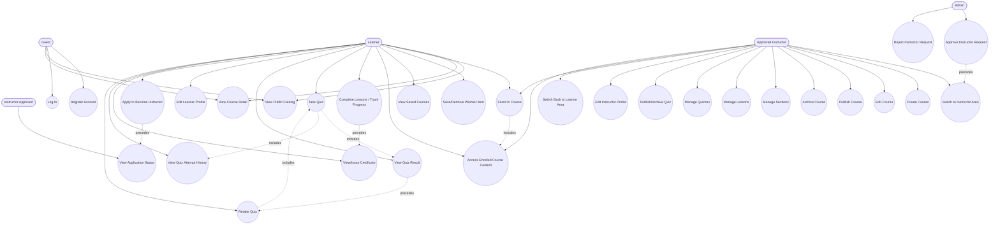

# Application Use Cases

This document is the use-case reference for the Learnova PFA report. It
describes the platform's functional behavior from the actor's point of view,
complementing `core-workflows.md` (which documents end-to-end workflows with
exact request sequences) and `api-summary.md` (the endpoint reference).

Every use case below is checked against `backend/src/main/java` controllers,
`frontend/src/router/index.tsx`, and the existing `docs/report/` package.
**Implemented** use cases are wired end-to-end (backend endpoint + frontend
screen). **Planned / not fully implemented** use cases are marked explicitly
and must not be presented as complete in the report or demo. Live-session,
rich lesson media, quiz analytics, and broader admin user-management
capability are not claimed as complete — none of these exist in this
codebase per `limitations.md`. Quiz attempt history and retake **are**
implemented (see UC-10, UC-11, UC-29, UC-30) — correct answers remain
hidden before submission in every case. **Certificates** are now implemented
end-to-end: a real certificate backend module (`certificate/controller`,
`entity`, `service`, `repository`) and two frontend pages (`CertificatesPage`,
`CertificateViewPage`) exist and are wired to live endpoints, and — as of the
certificate-issuance UI work that followed this validation pass —
`CoursePlayerPage` now exposes a certificate panel that calls the issuance
endpoint once a course reaches 100% progress. See UC-28 for the exact flow
and remaining caveats (issuance is manual, not automatic).

---

## 1. Actor Summary

| Actor | Description |
|---|---|
| **Guest** | Unauthenticated visitor. Can browse the public landing page, course catalog, and course detail pages. Cannot enroll, save courses, or access any dashboard. |
| **Learner** | Authenticated user with a `LearnerProfile` (created automatically at registration). Every registered user is a learner by default. Enrolls in courses, studies lessons, takes quizzes, manages a wishlist, edits their own profile. |
| **Instructor applicant** | An authenticated user (learner) who has submitted an instructor request (`InstructorProfile.approvalStatus = PENDING`) but has not yet been approved. Has no instructor capabilities yet. |
| **Approved instructor** | A user whose `InstructorProfile.approvalStatus = APPROVED`. `availableProfiles` includes `INSTRUCTOR`. Can create/manage courses, content, and quizzes for courses they own. Retains their learner profile and capabilities simultaneously (dual-profile model). |
| **Admin** | A user with `ROLE_ADMIN`. Reviews and approves/rejects pending instructor requests; creates categories. Has no broader user-management console. |

These actors are not mutually exclusive roles in the database sense — they
are states of a single `User` account under the dual-profile model. A user
can be simultaneously an approved instructor and an active learner.

`★ Insight ─────────────────────────────────────`
The actor list here isn't five separate account types — it's one `User` row
moving through states. "Instructor applicant" and "Approved instructor" are
just values of `InstructorProfile.approvalStatus`, not distinct entities.
This is why `ProfileAccessService.resolveAvailableProfiles()` (per
CLAUDE.md) is the single source of truth: any use-case actor boundary in
this document maps to a check against that resolved state, not a hardcoded
role flag.
`─────────────────────────────────────────────────`

---

## 2. Use-Case Diagram

`★ Insight ─────────────────────────────────────`
Notice `Instructor --> UC5` and `Instructor --> UC8` on the diagram: an
approved instructor is still a learner underneath, so nothing stops them
from enrolling in someone else's published course and going through the
exact same `CourseAccessService.canUserAccessCourseContent()` enrollment
check as any other learner. The dual-profile model means "Instructor" never
replaces "Learner" capabilities — it's additive.
`─────────────────────────────────────────────────`

---

## 3. Detailed Use Cases

### UC-1: Register Account
- **Status:** Implemented
- **Primary actor:** Guest
- **Goal:** Create a platform account and obtain a learner profile.
- **Preconditions:** Visitor is not authenticated; supplies a unique email.
- **Main success flow:**
  1. Guest opens `/register`, submits full name, email, password.
  2. Backend creates a `User` row and automatically creates a `LearnerProfile`.
  3. Guest is redirected toward `/login`.
- **Alternative/error flows:**
  - Email already registered → backend rejects with a validation/conflict error; form surfaces the message.
  - Invalid input (e.g., malformed email, weak password) → Bean Validation error returned and displayed inline.
- **Postconditions:** A `User` row exists with `ROLE_LEARNER`; a `LearnerProfile` is linked 1-to-1.
- **Frontend routes:** `/register` (under `GuestRoute`)
- **Backend endpoints:** `POST /api/v1/auth/register` (public)
- **Entities/tables:** `User`, `Role`, `LearnerProfile`

---

### UC-2: Log In
- **Status:** Implemented
- **Primary actor:** Guest (becomes Learner on success)
- **Goal:** Authenticate and obtain a session to access protected areas.
- **Preconditions:** A registered account exists.
- **Main success flow:**
  1. Guest opens `/login`, submits email and password.
  2. Backend validates credentials and issues a JWT.
  3. Frontend stores the token, fetches `GET /api/v1/auth/me`, and populates `AuthContext` (`user`, `roles`, `availableProfiles`, `instructorApprovalStatus`).
  4. `activeProfile` is initialised to `'LEARNER'`.
  5. Guest is redirected to `/dashboard`.
- **Alternative/error flows:**
  - Wrong credentials → 401, error message shown, no token stored.
  - Account status not active (per `AccountStatus`) → security layer rejects with a consistent JSON error.
- **Postconditions:** JWT held in `localStorage`; `AuthContext` populated; protected routes accessible.
- **Frontend routes:** `/login` (under `GuestRoute`) → `/dashboard`
- **Backend endpoints:** `POST /api/v1/auth/login`, `GET /api/v1/auth/me`
- **Entities/tables:** `User`, `Role`, `AccountStatus`

---

### UC-3: View Public Course Catalog
- **Status:** Implemented
- **Primary actor:** Guest (also usable by Learner/Instructor/Admin)
- **Goal:** Browse published courses without authenticating.
- **Preconditions:** None.
- **Main success flow:**
  1. Visitor opens `/courses`.
  2. Frontend calls `GET /api/v1/courses`, lists published courses with category/level badges.
  3. Authenticated learners additionally see "Continue" CTA on already-enrolled courses; guests see only catalog browsing.
- **Alternative/error flows:** Empty catalog → empty-state UI. Network/API error → retry panel.
- **Postconditions:** None (read-only).
- **Frontend routes:** `/courses` (no guard)
- **Backend endpoints:** `GET /api/v1/courses`, `GET /api/v1/categories`
- **Entities/tables:** `Course`, `Category`

---

### UC-4: View Public Course Detail
- **Status:** Implemented
- **Primary actor:** Guest (also usable by Learner/Instructor/Admin)
- **Goal:** Inspect a single published course before deciding to enroll.
- **Preconditions:** Course exists and is `PUBLISHED`.
- **Main success flow:**
  1. Visitor opens `/courses/:courseId`.
  2. Frontend calls `GET /api/v1/courses/{courseId}`.
  3. Page renders marketing chrome (`Navbar` + `Footer`) and a state-dependent action panel: guest → sign-in CTA; authenticated non-enrolled learner → enroll CTA; enrolled learner → continue-learning CTA.
- **Alternative/error flows:**
  - Course not found or not published → 404 not-found panel.
  - Generic fetch error → retry panel.
- **Postconditions:** None (read-only). Does **not** expose lesson/section previews, instructor bio, duration, lesson count, price, or rating — none of these fields exist on the backend contract.
- **Frontend routes:** `/courses/:courseId` (no guard)
- **Backend endpoints:** `GET /api/v1/courses/{courseId}`
- **Entities/tables:** `Course`, `Category`

---

### UC-5: Enroll in a Course
- **Status:** Implemented
- **Primary actor:** Learner (including an approved instructor acting as a learner)
- **Goal:** Gain access to a published course's lesson and quiz content.
- **Preconditions:** Authenticated; target course is `PUBLISHED` (drafts blocked); no existing enrollment for the same (learner, course) pair.
- **Main success flow:**
  1. Learner clicks "Enroll" on the catalog or course detail page.
  2. Backend creates an `Enrollment` row with `status = ACTIVE`.
  3. Frontend swaps the CTA to "Continue learning", linking to the course player.
- **Alternative/error flows:**
  - Course is `DRAFT` → enrollment blocked by backend.
  - Already enrolled → idempotent/handled state, no duplicate row (unique per learner+course).
- **Postconditions:** `Enrollment.status = ACTIVE`; learner can reach `/dashboard/courses/:courseId`.
- **Frontend routes:** `/courses`, `/courses/:courseId` → `/dashboard/courses/:courseId`
- **Backend endpoints:** `POST /api/v1/courses/{courseId}/enroll`, `GET /api/v1/learner/enrollments`, `GET /api/v1/learner/enrollments/{courseId}`
- **Entities/tables:** `Enrollment`, `Course`, `LearnerProfile`

---

### UC-6: Save / Remove Course from Wishlist
- **Status:** Implemented
- **Primary actor:** Learner (`ROLE_LEARNER` only)
- **Goal:** Bookmark a course for later without enrolling.
- **Preconditions:** Authenticated with `ROLE_LEARNER`. Eligibility gate: `isAuthenticated && user.roles.includes('ROLE_LEARNER')` (an admin-only account without the learner role would not see this action).
- **Main success flow:**
  1. On `/courses/:courseId`, an eligible learner clicks "Save for later".
  2. Backend creates a `WishlistItem` via `POST /api/v1/wishlist/course/{courseId}`.
  3. Saved state is derived client-side from `GET /api/v1/wishlist?size=200` (no per-course status endpoint exists), building a `Set` of saved course IDs.
  4. Learner can remove the item from the same page or from `/dashboard/saved-courses` via `DELETE`.
- **Alternative/error flows:**
  - Add an already-saved course → `409`, treated as "already saved" silently.
  - Remove an already-removed course → `404`, treated as "already removed" silently.
  - Guest visits the page → sees "Sign in to save this course" link instead of the action; no wishlist call is ever made.
- **Postconditions:** A `WishlistItem` row added/removed. Wishlist is independent of enrollment — saving never unlocks content, and enrolling never auto-removes a wishlist entry.
- **Frontend routes:** `/courses/:courseId`, `/dashboard/saved-courses`
- **Backend endpoints:** `GET /api/v1/wishlist`, `POST /api/v1/wishlist/course/{courseId}`, `DELETE /api/v1/wishlist/course/{courseId}`
- **Entities/tables:** `WishlistItem`, `Course`, `LearnerProfile`

---

### UC-7: View Saved Courses
- **Status:** Implemented
- **Primary actor:** Learner
- **Goal:** Review and manage all wishlist items in one place.
- **Preconditions:** Authenticated learner.
- **Main success flow:**
  1. Learner opens `/dashboard/saved-courses`.
  2. Frontend calls `GET /api/v1/wishlist?size=200`, renders cards (category, level, title linking to course detail, description, instructor name, Remove button).
  3. Learner removes an item inline.
- **Alternative/error flows:** Empty wishlist → empty state linking to `/courses`. Fetch error → retry panel. Per-card remove error → inline error, item stays.
- **Postconditions:** None beyond removal side-effects covered in UC-6. Page does not show enrollment CTA, progress, duration, lesson count, price, rating, or certificate claims.
- **Frontend routes:** `/dashboard/saved-courses` (under `ProtectedRoute` + `DashboardLayout`)
- **Backend endpoints:** `GET /api/v1/wishlist`, `DELETE /api/v1/wishlist/course/{courseId}`
- **Entities/tables:** `WishlistItem`, `Course`

---

### UC-8: Access Enrolled Course Content
- **Status:** Implemented
- **Primary actor:** Enrolled Learner
- **Goal:** Open the course player to view structured section/lesson content.
- **Preconditions:** Authenticated; `Enrollment.status` is `ACTIVE` or `COMPLETED` for the target course. Non-enrolled access returns `404` (content enumeration protection — not `403`, so unauthorized users cannot distinguish "doesn't exist" from "not enrolled").
- **Main success flow:**
  1. Learner opens `/dashboard/courses/:courseId`.
  2. Frontend calls `GET /api/v1/learner/courses/{courseId}/content`; backend's `CourseAccessService.canUserAccessCourseContent()` performs the real enrollment check.
  3. Player renders section/lesson structure with per-lesson progress and auto-selects the first incomplete lesson.
- **Alternative/error flows:** Not enrolled or `CANCELLED` enrollment → `404` → enrollment-specific error panel in the UI.
- **Postconditions:** None (read access). Lesson content body itself is a placeholder panel — no video/rich text rendering exists yet.
- **Frontend routes:** `/dashboard/courses/:courseId` (Lessons tab, under `ProtectedRoute`)
- **Backend endpoints:** `GET /api/v1/learner/courses/{courseId}/content`
- **Entities/tables:** `Enrollment`, `Section`, `Lesson`, `LessonProgress`

---

### UC-9: Complete Lessons and Track Progress
- **Status:** Implemented
- **Primary actor:** Enrolled Learner
- **Goal:** Mark lessons complete and have course-level progress reflect it.
- **Preconditions:** Same enrollment gate as UC-8.
- **Main success flow:**
  1. Learner marks a lesson complete in the player; UI updates optimistically.
  2. Backend atomically updates `LessonProgress` and syncs `Enrollment.progressPercentage` in the same transaction (`PATCH /api/v1/lessons/{lessonId}/progress`).
  3. When all lessons are complete, `Enrollment.status` transitions to `COMPLETED` with `completedAt` set.
- **Alternative/error flows:** Backend rejects update (e.g., non-enrolled, `CANCELLED` enrollment) → `404` → frontend rolls back the optimistic UI change.
- **Postconditions:** `LessonProgress` row updated; `Enrollment.progressPercentage` kept in sync; possible `Enrollment.status = COMPLETED`.
- **Frontend routes:** `/dashboard/courses/:courseId` (Lessons tab)
- **Backend endpoints:** `PATCH /api/v1/lessons/{lessonId}/progress`, `GET /api/v1/lessons/course/{courseId}/progress`
- **Entities/tables:** `LessonProgress`, `Lesson`, `Enrollment`

---

### UC-10: Take Quiz
- **Status:** Implemented
- **Primary actor:** Enrolled Learner
- **Goal:** Attempt a published quiz tied to an enrolled course.
- **Preconditions:** Enrollment `ACTIVE`/`COMPLETED`; quiz `status = PUBLISHED` (DRAFT/ARCHIVED quizzes return `404` to the learner).
- **Main success flow:**
  1. Learner opens the Quizzes tab in the course player; quizzes lazy-load on first activation via `GET /api/v1/learner/courses/{courseId}/quizzes`.
  2. Learner starts an attempt via `POST /api/v1/learner/quizzes/{quizId}/attempts` — idempotent, resumes an existing `IN_PROGRESS` attempt if one exists.
  3. Learner selects one answer option per question via native radio controls. Answer option DTOs never carry `isCorrect` — correctness is never exposed before submission.
  4. Submit is enabled only once every question has a selection.
  5. Learner submits via `POST /api/v1/learner/quiz-attempts/{attemptId}/submit`.
- **Alternative/error flows:**
  - Re-submitting an already-`SUBMITTED` attempt → `409`; frontend then fetches the stored result via `GET /api/v1/learner/quiz-attempts/{attemptId}` instead.
  - Submission missing answers, duplicate answers, or options not belonging to their question → backend validation rejects the request.
- **Postconditions:** A `QuizAttempt` row with `status = SUBMITTED`, computed `scorePercentage` and `passed`; one `QuizAttemptAnswer` per question. Prior `SUBMITTED` attempts for the same quiz are never overwritten — see UC-29/UC-30.
- **Frontend routes:** `/dashboard/courses/:courseId` (Quizzes tab)
- **Backend endpoints:** `GET /api/v1/learner/courses/{courseId}/quizzes`, `GET /api/v1/learner/quizzes/{quizId}`, `POST /api/v1/learner/quizzes/{quizId}/attempts`, `POST /api/v1/learner/quiz-attempts/{attemptId}/submit`
- **Entities/tables:** `Quiz`, `Question`, `AnswerOption`, `QuizAttempt`, `QuizAttemptAnswer`

---

### UC-11: View Quiz Result
- **Status:** Implemented
- **Primary actor:** Enrolled Learner (own attempt only)
- **Goal:** See the score and per-question correctness for a submitted attempt.
- **Preconditions:** A `SUBMITTED` `QuizAttempt` owned by the caller.
- **Main success flow:**
  1. After submission (or after a `409`-triggered re-fetch), frontend calls `GET /api/v1/learner/quiz-attempts/{attemptId}`.
  2. Result panel renders score percentage, passed/not-passed badge, earned vs. total points, and per-question correct/incorrect feedback.
- **Alternative/error flows:** Attempt belongs to another learner → ownership check rejects the request.
- **Postconditions:** None (read-only). A learner can also reach this same result later from the attempt-history list (UC-29) via "View result" instead of only right after submitting.
- **Frontend routes:** `/dashboard/courses/:courseId` (Quizzes tab, result panel)
- **Backend endpoints:** `GET /api/v1/learner/quiz-attempts/{attemptId}`
- **Entities/tables:** `QuizAttempt`, `QuizAttemptAnswer`

---

### UC-12: Edit Learner Profile
- **Status:** Implemented
- **Primary actor:** Learner
- **Goal:** Update self-owned profile fields.
- **Preconditions:** Authenticated.
- **Main success flow:**
  1. User opens `/dashboard/settings`.
  2. Frontend loads current values via `GET /api/v1/learner-profile/me`.
  3. User edits `displayName`, `bio`, `profileImageUrl` and submits via `PATCH /api/v1/learner-profile/me`.
- **Alternative/error flows:** Validation errors (e.g., field length) surfaced inline.
- **Postconditions:** `LearnerProfile` updated. No profile id ever appears in the URL/body — backend resolves the target from the authenticated principal, so cross-user edits are impossible by construction.
- **Frontend routes:** `/dashboard/settings`
- **Backend endpoints:** `GET /api/v1/learner-profile/me`, `PATCH /api/v1/learner-profile/me`
- **Entities/tables:** `LearnerProfile`

---

### UC-13: Apply to Become Instructor
- **Status:** Implemented
- **Primary actor:** Learner (becomes Instructor applicant on submission)
- **Goal:** Request instructor access.
- **Preconditions:** Authenticated; no existing `InstructorProfile`, or a prior one not currently pending.
- **Main success flow:**
  1. User opens the instructor application panel in `/dashboard/settings` and submits bio (required, max 1000 chars) and expertise (required, max 500 chars), with optional experience/motivation.
  2. Backend creates an `InstructorProfile` with `approvalStatus = PENDING` via `POST /api/v1/instructor-profile/request`.
- **Alternative/error flows:** Missing required fields → inline validation error, no request sent.
- **Postconditions:** `InstructorProfile.approvalStatus = PENDING`; user becomes an Instructor applicant; sidebar shows a "pending review" note.
- **Frontend routes:** `/dashboard/settings`
- **Backend endpoints:** `POST /api/v1/instructor-profile/request`
- **Entities/tables:** `InstructorProfile`

---

### UC-14: View Instructor Application Status
- **Status:** Implemented
- **Primary actor:** Instructor applicant
- **Goal:** Check the current state of an instructor request.
- **Preconditions:** An `InstructorProfile` exists for the user.
- **Main success flow:**
  1. `GET /api/v1/auth/me` returns `instructorApprovalStatus` on every app load via `useCurrentUser`.
  2. Settings page surfaces the state: `null` → "Become an Instructor" CTA; `PENDING` → pending badge, instructor mode hidden; `APPROVED` → profile switcher available; `REJECTED` → rejected status, lazily fetches `GET /api/v1/instructor-profile/me` for the `rejectionReason` and displays it inline.
- **Alternative/error flows:** None beyond standard fetch error handling.
- **Postconditions:** None (read-only).
- **Frontend routes:** `/dashboard/settings`
- **Backend endpoints:** `GET /api/v1/auth/me`, `GET /api/v1/instructor-profile/me`
- **Entities/tables:** `InstructorProfile`

---

### UC-15: Approve Instructor Request
- **Status:** Implemented
- **Primary actor:** Admin
- **Goal:** Grant instructor access to a pending applicant.
- **Preconditions:** Authenticated with `ROLE_ADMIN`; a pending `InstructorProfile` exists.
- **Main success flow:**
  1. Admin opens `/admin/instructor-approvals`.
  2. Frontend lists pending requests via `GET /api/v1/admin/instructor-profiles/pending`.
  3. Admin approves via `POST /api/v1/admin/instructor-profiles/{id}/approve`.
- **Alternative/error flows:** Approving an already-decided profile → backend rejects (state already terminal).
- **Postconditions:** `InstructorProfile.approvalStatus = APPROVED`; the user's `availableProfiles` will include `INSTRUCTOR` on the next `/auth/me` refresh. **Admin approval is the only path to the `INSTRUCTOR` role** — there is no auto-approval or self-grant.
- **Frontend routes:** `/admin/instructor-approvals` (under `AdminRoute`)
- **Backend endpoints:** `GET /api/v1/admin/instructor-profiles/pending`, `POST /api/v1/admin/instructor-profiles/{profileId}/approve`
- **Entities/tables:** `InstructorProfile`, `User`, `Role`

---

### UC-16: Reject Instructor Request
- **Status:** Implemented
- **Primary actor:** Admin
- **Goal:** Deny instructor access with a reason.
- **Preconditions:** Same as UC-15.
- **Main success flow:**
  1. Admin reviews a pending request on `/admin/instructor-approvals`.
  2. Admin rejects with a reason via `POST /api/v1/admin/instructor-profiles/{id}/reject`.
- **Alternative/error flows:** Rejecting an already-decided profile → backend rejects.
- **Postconditions:** `InstructorProfile.approvalStatus = REJECTED` with stored `rejectionReason`. `INSTRUCTOR` role/`availableProfiles` entry never granted. Resubmission behavior after rejection depends on the current implementation of the request endpoint and is not independently verified in this document.
- **Frontend routes:** `/admin/instructor-approvals`
- **Backend endpoints:** `POST /api/v1/admin/instructor-profiles/{profileId}/reject`
- **Entities/tables:** `InstructorProfile`

---

### UC-17: Switch to Instructor Area
- **Status:** Implemented (navigation only) — **the backend `activeProfile` switch endpoint itself is Planned / not fully implemented on the frontend**
- **Primary actor:** Approved Instructor
- **Goal:** Move from the learner experience to the instructor course-management area.
- **Preconditions:** `availableProfiles` includes `INSTRUCTOR` (i.e., `approvalStatus = APPROVED`).
- **Main success flow:**
  1. Approved instructor navigates to `/instructor/courses` (a separate shell, `InstructorLayout`, not nested under the learner `DashboardLayout`).
  2. `InstructorRoute` checks `isAuthenticated` + `availableProfiles` includes `'INSTRUCTOR'`; access is granted.
- **Alternative/error flows:** `INSTRUCTOR` not in `availableProfiles` → redirected to `/unauthorized` (not `/login`, since the user is already authenticated).
- **Postconditions:** Instructor-only routes accessible.
- **Frontend routes:** `/instructor/courses`, `/instructor/courses/:courseId/content`, `/instructor/courses/:courseId/quizzes` (all under `InstructorRoute`)
- **Backend endpoints:** None required for this navigation itself; `POST /api/v1/profile/switch` exists on the backend but **no frontend component currently calls it** — there is no profile-switcher UI. Today, instructor-area access is route-guard-based (`availableProfiles` check), not an explicit "switch" action with a persisted `activeProfile` server round-trip.
- **Entities/tables:** `InstructorProfile`, `User`

---

### UC-18: Create Course
- **Status:** Implemented
- **Primary actor:** Approved Instructor
- **Goal:** Start authoring a new course.
- **Preconditions:** `availableProfiles` includes `INSTRUCTOR`.
- **Main success flow:**
  1. Instructor opens `/instructor/courses`, submits title, description, level, category, optional thumbnail URL.
  2. Backend creates a `Course` with `status = DRAFT`, owned by the caller's `InstructorProfile`.
- **Alternative/error flows:** Validation errors (missing required fields) surfaced inline.
- **Postconditions:** New `Course` row, `status = DRAFT`, not visible in the public catalog.
- **Frontend routes:** `/instructor/courses`
- **Backend endpoints:** `POST /api/v1/instructor/courses`
- **Entities/tables:** `Course`, `Category`, `InstructorProfile`

---

### UC-19: Edit Course
- **Status:** Implemented
- **Primary actor:** Approved Instructor (owner only)
- **Goal:** Update a course's metadata.
- **Preconditions:** Caller owns the course.
- **Main success flow:**
  1. Instructor edits course fields on `/instructor/courses`.
  2. Backend applies the update via `PATCH /api/v1/instructor/courses/{courseId}`, with an ownership check.
- **Alternative/error flows:** Editing a course owned by another instructor → ownership check rejects (not exposed in UI navigation, but enforced server-side regardless).
- **Postconditions:** `Course` fields updated.
- **Frontend routes:** `/instructor/courses`
- **Backend endpoints:** `PATCH /api/v1/instructor/courses/{courseId}`
- **Entities/tables:** `Course`

---

### UC-20: Publish Course
- **Status:** Implemented
- **Primary actor:** Approved Instructor (owner only)
- **Goal:** Make a course visible in the public catalog.
- **Preconditions:** Course is `DRAFT` and owned by the caller.
- **Main success flow:**
  1. Instructor triggers publish from `/instructor/courses`.
  2. Backend transitions `Course.status` `DRAFT → PUBLISHED` via `POST /api/v1/instructor/courses/{courseId}/publish`.
- **Alternative/error flows:** Publishing a non-`DRAFT` course (e.g., already `ARCHIVED`) → backend rejects the transition.
- **Postconditions:** `Course.status = PUBLISHED`; visible in `GET /api/v1/courses`.
- **Frontend routes:** `/instructor/courses`
- **Backend endpoints:** `POST /api/v1/instructor/courses/{courseId}/publish`
- **Entities/tables:** `Course`

---

### UC-21: Archive Course
- **Status:** Implemented
- **Primary actor:** Approved Instructor (owner only)
- **Goal:** Retire a course from active management/visibility.
- **Preconditions:** Course is `DRAFT` or `PUBLISHED`, owned by the caller.
- **Main success flow:**
  1. Instructor triggers archive from `/instructor/courses`.
  2. Backend transitions `Course.status` to `ARCHIVED` via `POST /api/v1/instructor/courses/{courseId}/archive`.
- **Alternative/error flows:** Any further mutation attempts on sections/lessons/quizzes of an `ARCHIVED` course return `409`.
- **Postconditions:** `Course.status = ARCHIVED` — terminal; this transition is one-directional, there is no un-archive.
- **Frontend routes:** `/instructor/courses`
- **Backend endpoints:** `POST /api/v1/instructor/courses/{courseId}/archive`
- **Entities/tables:** `Course`

---

### UC-22: Manage Course Sections
- **Status:** Implemented
- **Primary actor:** Approved Instructor (owner only)
- **Goal:** Organize a course into sections.
- **Preconditions:** Caller owns the course; course is not `ARCHIVED`.
- **Main success flow:**
  1. Instructor opens `/instructor/courses/:courseId/content`.
  2. Instructor creates a section (`POST .../sections`), edits its title (`PATCH .../sections/{sectionId}`), or deletes it (`DELETE .../sections/{sectionId}`, cascades lessons), with inline confirm and optimistic state.
- **Alternative/error flows:** Mutation on an `ARCHIVED` course → `409`.
- **Postconditions:** `Section` rows created/updated/deleted under the course. **Planned / not fully implemented:** no explicit ordering field — sections are always appended, no drag-reorder.
- **Frontend routes:** `/instructor/courses/:courseId/content`
- **Backend endpoints:** `GET/POST /api/v1/instructor/courses/{courseId}/sections` (read via content endpoint), `PATCH/DELETE /api/v1/instructor/courses/sections/{sectionId}`
- **Entities/tables:** `Section`, `Course`

---

### UC-23: Manage Lessons
- **Status:** Implemented
- **Primary actor:** Approved Instructor (owner only)
- **Goal:** Add and maintain lessons within a section.
- **Preconditions:** Caller owns the course; course/section not `ARCHIVED`.
- **Main success flow:**
  1. Within `/instructor/courses/:courseId/content`, instructor creates a lesson under a section (`POST .../sections/{sectionId}/lessons`), edits its title (`PATCH .../lessons/{lessonId}`), or deletes it (`DELETE .../lessons/{lessonId}`).
- **Alternative/error flows:** Mutation on an `ARCHIVED` course → `409`.
- **Postconditions:** `Lesson` rows created/updated/deleted under the section. **Planned / not fully implemented:** lessons carry only a title in the management UI in terms of structured content — there is no rich body, video, or attached-resource authoring; the course player's lesson content area is a placeholder.
- **Frontend routes:** `/instructor/courses/:courseId/content`
- **Backend endpoints:** `POST /api/v1/instructor/courses/sections/{sectionId}/lessons`, `PATCH/DELETE /api/v1/instructor/courses/lessons/{lessonId}`
- **Entities/tables:** `Lesson`, `Section`

---

### UC-24: Manage Quizzes (Questions and Answer Options)
- **Status:** Implemented
- **Primary actor:** Approved Instructor (owner only)
- **Goal:** Author a quiz with questions and answer options for a course.
- **Preconditions:** Caller owns the course; course not `ARCHIVED`.
- **Main success flow:**
  1. Instructor opens `/instructor/courses/:courseId/quizzes`, creates a quiz (title, optional description, passing score %, optional section scope) via `POST /api/v1/instructor/courses/{courseId}/quizzes`.
  2. Instructor expands the quiz (lazy-loads detail via `GET .../quizzes/{quizId}`), adds questions (content, points, type `MULTIPLE_CHOICE` or `TRUE_FALSE`) via `POST .../quizzes/{quizId}/questions`, and adds/edits answer options (including marking `isCorrect`) via `POST/PUT .../questions/{questionId}/options` and `.../options/{optionId}`.
  3. Instructor can edit or delete questions/options at any point before archiving.
- **Alternative/error flows:** Mutation on an `ARCHIVED` quiz's course → backend-level rejection consistent with the `ARCHIVED` course rule.
- **Postconditions:** `Quiz`, `Question`, `AnswerOption` rows created/updated/deleted. **Planned / not fully implemented:** no question/option ordering (always appended, no drag-reorder); v1 supports single-correct-option questions only — no multi-select/partial-credit type.
- **Frontend routes:** `/instructor/courses/:courseId/quizzes`
- **Backend endpoints:** `GET/POST /api/v1/instructor/courses/{courseId}/quizzes`, `GET/PUT /api/v1/instructor/courses/quizzes/{quizId}`, `POST/PUT/DELETE` question and option endpoints
- **Entities/tables:** `Quiz`, `Question`, `AnswerOption`, `Course`, `Section`

---

### UC-25: Publish / Archive Quiz
- **Status:** Implemented
- **Primary actor:** Approved Instructor (owner only)
- **Goal:** Make a quiz available to enrolled learners, or retire it.
- **Preconditions:** Caller owns the quiz's course.
- **Main success flow:**
  1. Instructor publishes via `PATCH .../quizzes/{quizId}/publish`; backend validates the quiz has at least one question, every question has options, and at least one option per question is marked correct — friendly inline validation messages on failure.
  2. `Quiz.status` transitions `DRAFT → PUBLISHED`, now visible to enrolled learners.
  3. Instructor can later archive via `PATCH .../quizzes/{quizId}/archive`; the quiz and its questions/options render read-only after archiving.
- **Alternative/error flows:** Publish blocked with specific validation messages (no questions / question missing options / no correct option marked).
- **Postconditions:** `Quiz.status = PUBLISHED` or `ARCHIVED`. **Planned / not fully implemented:** archive is terminal — there is no unpublish or restore-from-archived transition in the UI or backend.
- **Frontend routes:** `/instructor/courses/:courseId/quizzes`
- **Backend endpoints:** `PATCH /api/v1/instructor/courses/quizzes/{quizId}/publish`, `PATCH /api/v1/instructor/courses/quizzes/{quizId}/archive`
- **Entities/tables:** `Quiz`, `Question`, `AnswerOption`

---

### UC-26: Edit Instructor Profile
- **Status:** Implemented
- **Primary actor:** Approved Instructor
- **Goal:** Update self-owned instructor profile fields.
- **Preconditions:** `INSTRUCTOR` in `availableProfiles`.
- **Main success flow:**
  1. Instructor opens `/dashboard/settings`; instructor section is shown only when `INSTRUCTOR` is in `availableProfiles`.
  2. Instructor edits `bio`, `expertise`, `experience`, `motivation` and submits via `PATCH /api/v1/instructor-profile/me`.
- **Alternative/error flows:** Validation errors surfaced inline.
- **Postconditions:** `InstructorProfile` fields updated. No profile id appears in the URL/body — resolved from the authenticated principal.
- **Frontend routes:** `/dashboard/settings`
- **Backend endpoints:** `GET /api/v1/instructor-profile/me`, `PATCH /api/v1/instructor-profile/me`
- **Entities/tables:** `InstructorProfile`

---

### UC-27: Switch Back to Learner Area
- **Status:** Implemented (navigation only) — same caveat as UC-17
- **Primary actor:** Approved Instructor
- **Goal:** Return to the learner dashboard experience.
- **Preconditions:** None beyond being authenticated (every user retains a `LearnerProfile`).
- **Main success flow:**
  1. From `/instructor/*`, the user navigates to `/dashboard` (a separate shell, `DashboardLayout`, guarded by `ProtectedRoute` only — no instructor-specific check).
- **Alternative/error flows:** None — this direction has no authorization gate beyond standard authentication.
- **Postconditions:** Learner dashboard rendered.
- **Frontend routes:** `/dashboard` (and its children)
- **Backend endpoints:** None specific to the switch itself; same note as UC-17 — `POST /api/v1/profile/switch` exists server-side but is not wired to any frontend "switch" UI. The learner/instructor "areas" today are two separate route trees the user navigates between, not a persisted `activeProfile` toggle round-tripped through the switch endpoint.
- **Entities/tables:** `LearnerProfile`, `User`

---

### UC-28: View / Issue Course Completion Certificate
- **Status:** Implemented
- **Primary actor:** Learner (own certificates only)
- **Goal:** Obtain and view a certificate of completion for a finished course.
- **Preconditions:** `Enrollment.status = COMPLETED` for the target course (enforced server-side; `CONFLICT`/409 if not yet completed).
- **Main success flow:**
  1. Learner finishes every lesson in a course; `progressPercentage` reaches 100% (see UC-9).
  2. On `/dashboard/courses/:courseId`, `CoursePlayerPage` renders a `CertificatePanel` once `progressPercentage === 100`. The panel first calls `GET /api/v1/learner/certificates` to check whether a certificate already exists for this course.
  3. If none exists, the panel shows an "Issue certificate" button. Clicking it calls `POST /api/v1/learner/certificates/course/{courseId}/issue` (idempotent: `201` on first issue, `200` returning the existing certificate on repeat calls).
  4. On success, the panel switches to a "View certificate" link to `/dashboard/certificates/:certificateId`.
  5. Learner can also reach the same certificate later via `/dashboard/certificates` (list, `GET /api/v1/learner/certificates`), clicking "View certificate" on a card, or from the Certificates section on the learner dashboard (`/dashboard`), which calls the same endpoint directly and links each card to the same view route.
  6. `/dashboard/certificates/:certificateId` (rendered outside `DashboardLayout` as a full-screen printable document via `CertificateViewPage`) calls `GET /api/v1/learner/certificates/{certificateId}` and renders the certificate (learner name, course title, instructor name, issued date, a generated `certificateCode`) with a "Print / Save as PDF" button (`window.print()` — no server-side PDF generation).
- **Important caveat — issuance is manual, not automatic:** the certificate panel only appears after a course reaches 100% progress, and the learner must explicitly click "Issue certificate" — there is no background job or completion hook that issues certificates without this click. `CertificatesPage`'s copy was corrected to say "Finish every lesson in a course to issue a certificate from the course player," replacing an earlier claim that certificates were issued automatically.
- **Alternative/error flows:** Certificate not found or not owned by the caller → `404`, "Certificate not found" panel with a back-link. Issuing for a non-`COMPLETED` enrollment → `409`, surfaced in the certificate panel via an accessible `role="alert"` message ("This course is not fully completed yet, so a certificate cannot be issued."). Any other issuance failure shows a generic accessible error message and lets the learner retry.
- **Postconditions:** A `Certificate` row (course, enrollment, learner profile, UUID `certificateCode`, `issuedAt`) once issued; read-only afterward — no revoke/regenerate flow exists.
- **Frontend routes:** `/dashboard/courses/:courseId` (certificate panel, under `ProtectedRoute`), `/dashboard` (Certificates section on the learner dashboard, under `ProtectedRoute` + `DashboardLayout`), `/dashboard/certificates` (list, under `ProtectedRoute` + `DashboardLayout`), `/dashboard/certificates/:certificateId` (full-screen view, under `ProtectedRoute` only, intentionally outside `DashboardLayout`)
- **Backend endpoints:** `POST /api/v1/learner/certificates/course/{courseId}/issue`, `GET /api/v1/learner/certificates`, `GET /api/v1/learner/certificates/{certificateId}` (all `ROLE_LEARNER`, self-scoped). Not modified as part of this UI work.
- **Entities/tables:** `Certificate`, `Enrollment`, `Course`, `LearnerProfile`

---

### UC-29: View Quiz Attempt History
- **Status:** Implemented
- **Primary actor:** Enrolled Learner (own attempts only)
- **Goal:** Review all of a learner's own past attempts at a quiz, not just the most recent one.
- **Preconditions:** Enrollment `ACTIVE`/`COMPLETED`; quiz `status = PUBLISHED` (DRAFT/ARCHIVED → `404`, same enumeration-protection pattern as UC-10).
- **Main success flow:**
  1. Learner expands the collapsible "Attempt history" panel on a quiz card in the Quizzes tab.
  2. Frontend calls `GET /api/v1/learner/quizzes/{quizId}/attempts`, fetched per quiz once the quiz list loads.
  3. Backend returns the caller's own attempts for that quiz, most-recent-first (`ORDER BY startedAt DESC`). `SUBMITTED` attempts include per-question result details; `IN_PROGRESS` attempts never expose answer correctness (no `QuizAttemptAnswer` rows exist for them yet).
  4. Each row shows attempt number, date, status, and — for `SUBMITTED` attempts — score and passed/not-passed; rows offer "Resume" (`IN_PROGRESS`) or "View result" (`SUBMITTED`).
- **Alternative/error flows:** No attempts yet → empty-state message ("No attempts yet."), not an error. Per-quiz history fetch failure → that quiz card's history silently stays empty (non-blocking, `Promise.allSettled`); does not block the rest of the Quizzes tab.
- **Postconditions:** None (read-only). No pagination — the endpoint returns the full attempt list for the quiz.
- **Frontend routes:** `/dashboard/courses/:courseId` (Quizzes tab, attempt-history panel)
- **Backend endpoints:** `GET /api/v1/learner/quizzes/{quizId}/attempts`
- **Entities/tables:** `QuizAttempt`, `QuizAttemptAnswer`

---

### UC-30: Retake Quiz
- **Status:** Implemented
- **Primary actor:** Enrolled Learner
- **Goal:** Attempt a quiz again after a prior submission, without losing the earlier result.
- **Preconditions:** Learner has at least one `SUBMITTED` attempt for the quiz; enrollment and quiz-status preconditions are the same as UC-10.
- **Main success flow:**
  1. After viewing a submitted result, learner clicks "Retake quiz" on the quiz card.
  2. Frontend calls `POST /api/v1/learner/quizzes/{quizId}/attempts`, the same idempotent start/resume endpoint used by UC-10.
  3. Because the prior attempt is already `SUBMITTED` (not `IN_PROGRESS`), the backend creates a brand-new `QuizAttempt` row rather than resuming — the earlier `SUBMITTED` attempt and its `QuizAttemptAnswer` rows are untouched.
  4. Learner answers and submits the new attempt exactly as in UC-10; the result panel and the attempt-history list (UC-29) both reflect the new attempt while the old one remains viewable.
- **Alternative/error flows:** None beyond the standard UC-10 submission error flows.
- **Postconditions:** A second (or further) `QuizAttempt` row for the same (learner, quiz) pair; all earlier `SUBMITTED` attempts remain stored and retrievable via UC-29/UC-11.
- **Frontend routes:** `/dashboard/courses/:courseId` (Quizzes tab)
- **Backend endpoints:** `POST /api/v1/learner/quizzes/{quizId}/attempts`, `POST /api/v1/learner/quiz-attempts/{attemptId}/submit`
- **Entities/tables:** `QuizAttempt`, `QuizAttemptAnswer`

---

## 4. Priority List

### Essential for demo
- UC-1 Register Account
- UC-2 Log In
- UC-3 View Public Course Catalog
- UC-4 View Public Course Detail
- UC-5 Enroll in a Course
- UC-8 Access Enrolled Course Content
- UC-9 Complete Lessons and Track Progress
- UC-10 Take Quiz
- UC-11 View Quiz Result
- UC-13 Apply to Become Instructor
- UC-15 Approve Instructor Request
- UC-18 Create Course
- UC-20 Publish Course
- UC-22 Manage Course Sections
- UC-23 Manage Lessons
- UC-24 Manage Quizzes
- UC-25 Publish/Archive Quiz

### Important for report
- UC-6 Save/Remove Wishlist Item
- UC-7 View Saved Courses
- UC-12 Edit Learner Profile
- UC-14 View Instructor Application Status
- UC-16 Reject Instructor Request
- UC-17 Switch to Instructor Area
- UC-19 Edit Course
- UC-21 Archive Course
- UC-26 Edit Instructor Profile
- UC-27 Switch Back to Learner Area
- UC-28 View/Issue Certificate — demo by completing a course's lessons in the player, then issuing the certificate from the certificate panel that appears at 100% progress
- UC-29 View Quiz Attempt History
- UC-30 Retake Quiz

### Planned / future extension
- A true `activeProfile` switcher UI calling `POST /api/v1/profile/switch` (the endpoint exists; nothing in the frontend calls it — see UC-17/UC-27)
- Pagination on the quiz attempt-history endpoint (currently returns the full unbounded list)
- Rich lesson content (video, text body, attachments) — the course player's lesson content area is a placeholder panel
- Section/lesson/question/answer-option ordering (drag-reorder); items are currently always appended
- Quiz timers, quiz analytics, and a learner-results dashboard for instructors
- Automatic certificate issuance on course completion (today's flow requires the learner to click "Issue certificate" from the course player; see UC-28), plus PDF download/sharing beyond the existing browser print
- Live sessions (no backend exists; frontend page is a placeholder)
- Catalog-card wishlist controls (currently the wishlist action exists only on course detail and saved-courses pages)
- Broader admin user management beyond instructor approvals and category creation

---

## 5. Methodology Note

These use cases were derived directly from this repository's source of
truth: the backend `@RestController`/`@Service`/`@Entity` classes under
`backend/src/main/java`, the frontend route tree at
`frontend/src/router/index.tsx` and feature pages/API clients under
`frontend/src`, and the existing `docs/report/` package (`core-workflows.md`,
`api-summary.md`, `limitations.md`, `CURRENT_STATE.md`). No use case,
endpoint, or entity name in this document was invented — every claim traces
to a controller method, a router entry, a frontend component, or an explicit
statement in the existing report documents. Where a capability is incomplete
or absent (e.g., the profile switcher UI, live sessions), it is marked
**Planned / not fully implemented** rather than
presented as done. Where a capability is real on one side but not wired on
the other (e.g., the certificate issuance endpoint with no calling UI, the
`POST /api/v1/profile/switch` endpoint with no calling UI), it is marked
**Implemented (navigation only)** or **Partially implemented** with an
explicit gap note, consistent with the project's "no feature claimed unless
wired end-to-end" convention.

**`graphify` refresh attempted and failed.** This validation pass attempted
to refresh the project graph via `graphify update .` and `graphify query`,
since a `graphify-out/` artifact (including `graph.json`, `GRAPH_REPORT.md`,
and `manifest.json`) exists in this working copy from a prior run. The
`graphify` CLI binary itself is not available in this environment — it is
absent from `PATH`, not resolvable via `npx`, and not present anywhere on
disk outside the pre-existing `graphify-out/` output directory. Both the
update and query commands failed with "command not found." Per the task's
explicit fallback instruction, the refresh was not retried repeatedly;
instead, this document was validated by direct, manual inspection of the
backend controllers/services/entities and frontend router/pages/API
clients listed above. The stale `graphify-out/` artifacts were not read as
supporting evidence, since they predate the certificate feature confirmed
present in this pass and could not be regenerated to confirm currency.
